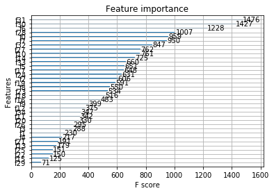

# Purchase-Forecast
消费金融场景下的用户购买预测

Xgboost中各特征的重要程度： 
  

利用K 折交叉验证结果： 

    Train: [    1     2     4 ... 79995 79996 79997] | test: [    0     3    11 ... 79989 79998 79999] 
    [0.00434119 0.6025483  0.02001854 ... 0.06857971 0.01875654 0.0127498 ]
    [0 0 0 ... 0 0 0] 
    auc value: 0.8594822628410972 
    Train: [    0     1     2 ... 79997 79998 79999] 
    test: [    9    10    14 ... 79983 79986 79993] 
    [0.00735165 0.00394151 0.00457977 ... 0.03798921 0.17798391 0.00655987]
    [0 0 0 ... 0 0 0]
    auc value: 0.8488798809032697
    Train: [    0     1     2 ... 79997 79998 79999] | test: [    5    13    20 ... 79992 79994 79996]
    [0.13988204 0.02074813 0.03683876 ... 0.00525732 0.08249502 0.02808336]
    [0 0 0 ... 0 0 0]
    auc value: 0.8504618585546965
    Train: [    0     1     2 ... 79996 79998 79999] | test: [    4     7    16 ... 79988 79991 79997]
    [0.00285079 0.00423299 0.0121091  ... 0.05964969 0.02129328 0.00414714]
    [0 0 0 ... 0 0 0]
    auc value: 0.8651734820163426
    Train: [    0     3     4 ... 79997 79998 79999] | test: [    1     2     6 ... 79979 79990 79995] 
    [0.0448336  0.01456433 0.07772837 ... 0.03020816 0.05528628 0.03125471]
    [0 0 0 ... 0 0 0]
    auc value: 0.8421584766106266
    validate result: 0.8532311921852065